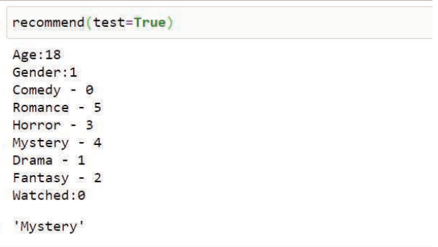

# Movie Recommender:
This model suggests the movie genre, a person likes, if the person’s age, gender and previously watched movie genre is provided as input.



The recommended movie genre is **'Mystery'** for a **'18'** years-old **'Male'** who has watched a **'comedy'**  movie previously.

## Set up and Installation:
```bash
pip install --upgrade pip
pip install -r requirements.txt
```
